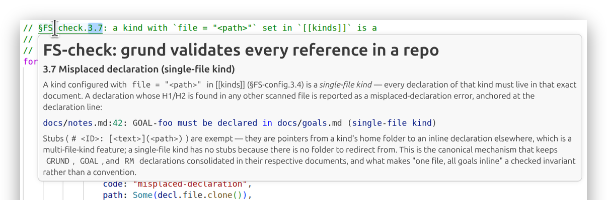
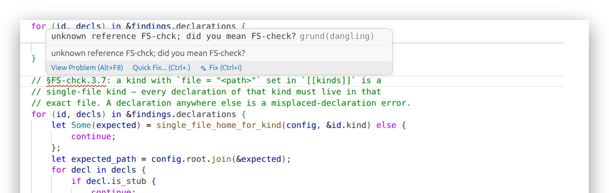
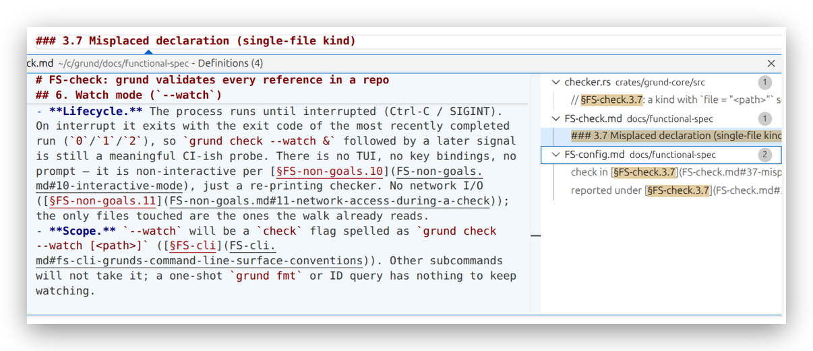

# grund

[](https://github.com/vjovanov/grund/actions/workflows/ci.yml)
[](docs/benchmarks.md)
[](https://crates.io/crates/grund)
[](LICENSE)

> **Keep your agents grounded** — specs, docs, and code as one knowledge graph, always in sync.

`grund` exists so you always know *why* — why your agents did what they did, why a line is the way it is: all work stays grounded in the spec that called for it ([§GRUND-grund](docs/grund.md#grund-grund-agents-stay-grounded-in-the-spec)). It keeps three promises. Every line of code stays understood — each cites the spec point that says why it exists ([§GRUND-every-line-understood](docs/grund.md#grund-every-line-understood-every-line-of-code-stays-understood)). The project's long-term memory reads in minimal tokens — every fact has a stable ID, fetched on demand instead of re-read from whole files ([§GRUND-token-cheap-memory](docs/grund.md#grund-token-cheap-memory-the-projects-long-term-memory-reads-in-minimal-tokens)). And the structure stays consistent — `grund check` fails the build the moment work and spec drift apart ([§GRUND-consistent-structure](docs/grund.md#grund-consistent-structure-the-structure-stays-consistent)).

`grund` is built around one workflow:

0. **Specify your intent.** Declare the goal, spec, or decision as a `# <ID>: …` heading before any code or doc cites it.
1. **Cite as you write.** Every code unit carries a `§<ID>` back to the spec section it implements (`§<KIND>-<slug>[.section]` — full grammar in [§4](#4-the-structure-that-gets-cited)).
2. **Re-read before you edit.** `grund <ID>.<section>` pulls just that subsection into context — no full-file reads, no token bloat.
3. **No dangling pointers.** `grund check` validates that every cited ID resolves — in `.md`, Rust `///`, Java doc-comments, Python docstrings, Go `//`, JSDoc, every doc-comment form `grund` knows about.

Off-the-shelf Markdown link checkers (`lychee`, `markdown-link-check`) only handle `.md` and only validate `[text](url)`. A `§`-marked citation of `FS-check.3.2` in `crates/grund-core/src/checker_references.rs` is invisible to them. That gap is what `grund` exists to close: Lychee checks whether Markdown links still open; `grund` checks whether your code still knows why it exists. Lychee is the link checker; `grund` is the intent checker. Both belong in CI; they guard different failure modes. [§GRUND-grund.1](docs/grund.md#1-what-grund-does-about-it)

`grund` measures CI performance by instruction count, not stopwatch time: the current snapshot is 299,672,739 Callgrind `Ir` for `grund check .` and 1,055,099,244 `Ir` for the generated 10k-file fixture, with pull requests gated at 5% growth.

## 0. Specify your intent

Before anything can be cited, the target has to exist. A declaration is a heading whose first token is the ID — `grund`'s own reason for being lives at [`docs/grund.md`](docs/grund.md):

```markdown
# GRUND-grund: agents stay grounded in the spec

Keep agents grounded in the spec — fewer bugs, cheaper LLM context,
faster onboarding. …
```

That heading lives in the configured home for its kind (`GRUND` → `docs/grund.md`, `FS` → `requirements.md`, `GOAL` → `docs/goals.md`, and so on — see [§4](#4-the-structure-that-gets-cited)). Once it's declared, any code, doc, or test can cite `§GRUND-grund` and `grund check` will resolve it. A declaration can live in code too: drop the `#` in a doc-comment — `grund`'s own architecture spec [`AR-checker`](crates/grund-core/src/checker.rs) opens with `/// AR-checker: how grund validates the scanner's findings`, right on the code it describes ([§4](#4-the-structure-that-gets-cited) shows the wiring).

## 1. Cite as you write

When code realizes a named behavior, it carries a `§<ID>` citation — on its doc-comment for a whole behavior, or inline beside the line that enforces one clause. From `grund`'s own source — the code implementing the missing-section check is grounded in [`FS-check.3.2`](docs/functional-spec/FS-check.md#32-missing-section), the spec section that defines that very check:

```rust
// crates/grund-core/src/checker_references.rs

/// The reference-resolution rule family — dangling citations (§FS-check.3.1),
/// missing sections (§FS-check.3.2), unknown project aliases (§FS-check.3.8), …

    // …
    // §FS-check.3.2: the ID resolves but no declaration has a heading at the
    // cited section path.
    if let Some(sec) = &cite.section {
        let any_match = decls.iter().any(|d| d.sections.contains_key(sec));
```

`grund` doesn't invent these citations — that's the contributor's call. What `grund` does is make sure the ones you wrote *resolve*. With `[reference] require_grounding = true`, it also fails scanned source files that carry no resolving citation; the stronger diff-aware "implementation changed with its spec or test" gate is tracked separately in [§RM-cochange-gate](docs/roadmap.md#rm-cochange-gate-a-pre-commit--ci-recipe--no-impl-change-without-spec-and-test).

## 2. Re-read before you edit

A citation is a pointer to a fact, not a file path. Resolve it without opening files:

```bash
$ grund FS-check.3.2
### 3.2 Missing section

A citation with a section suffix (`§FS-<user-login>.3.1`) where the declaration exists but the requested section heading does not.
```

`grund <ID>` returns *just* the useful slice — well under 200 lines for the common case — so the agent pulls one fact into context instead of an entire file. Its ladder:

- `grund <ID>` — the lead prose, cut at the first child section; the cheap default for a bare citation
- `grund <ID> --toc` — the lead plus the section map, for choosing the next subsection
- `grund <ID> --brief` — heading plus first paragraph only, for hover-sized previews
- `grund <ID> --full` — the full declaration body when the narrower reads are not enough
- `grund <ID> --format json` — for tooling

`grund refs <ID> --summary` gives the blast radius one file per line before a full citation dump, and `grund list --kind FS,AR` keeps discovery scoped. That's the "cheap grounding" half of the workflow: every agent fetches the same bytes for the same ID, every time.

## 3. Check for dangling pointers

Renumber the heading `### 3.2 Missing section` in [`FS-check.md`](docs/functional-spec/FS-check.md) and `grund check` flags every site that leaned on it — code and decision docs alike, in one resolver:

```
$ grund check
crates/grund-core/src/checker.rs:49: missing section FS-check.3.2
crates/grund-core/src/checker.rs:301: missing section FS-check.3.2
crates/grund-core/src/checker_references.rs:2: missing section FS-check.3.2
crates/grund-core/src/checker_references.rs:256: missing section FS-check.3.2
docs/decisions/functional/DF-require-grounding.md:8: missing section FS-check.3.2
```

`grund <path>` scans `<path>`; with no path it scans the canonical layout (`requirements.md`, `docs/`, `e2e/`, `src/`). In the scanned tree it enforces:

1. Every cited ID resolves to a declaration. *(dangling references)*
2. Every section coordinate (`.3.1`) resolves to a heading inside the declaration. *(missing sections)*
3. No ID is declared in two places. *(duplicates)*
4. Every stub heading `# <ID>: [<text>](<path>)` points at a file containing the inline declaration. *(broken stubs)*
5. The `AGENTS.md` / `CLAUDE.md` entry-point block is up to date. *(stale init)*
6. Declared-but-uncited IDs are flagged. *(unused — warning, not error; `E2E-` cases are exempt)*
7. *(opt-in)* With `[reference] require_grounding = true`: every source file carries at least one citation. *(ungrounded source file)*
8. *(workspace)* Alias-qualified citations resolve across configured sub-projects. *(cross-project references — see [§FS-workspace](docs/functional-spec/FS-workspace.md))*

`grund check` reads what `[scan] include` names, so a citation in a directory the config never mentioned is invisible rather than merely unchecked — it neither resolves nor dangles. `grund check --full` ([§FS-check.1.3](docs/functional-spec/FS-check.md#13-the-full-tree-scope---full)) walks the whole repository past that key and reports the references that resolve to nothing out there, and only those: a directory nobody configured is never judged against conventions it never adopted. It is purely additive, so it can only turn a green run red.

A passing text check prints `success` and exits 0. Findings go to stdout as `<path>:<line>: <message>` so editors and agents jump straight to the source, and `grund check | …` / `grund check --format=json | jq` work without redirection (the linter convention — only run-level `error:` lines, like an unreadable path, go to stderr). JSON output remains diagnostics-only, so a clean `grund check --format=json` prints nothing.

`grund` does **not** check Markdown links, URLs, spelling, or grammar. Use [`lychee`](https://github.com/lycheeverse/lychee), `vale`, etc. for those.

### Workspaces and sub-projects

In a monorepo, keep each sub-project as its own local namespace and let the root
config orchestrate them:

```toml
project_name = "root"

[workspace]
members = ["apps/api", "packages/*"]
include_root = true
```

Local citations stay short:

```markdown
§FS-session
```

Cross-project citations add a stable alias before the ID:

```markdown
§api/FS-session
§root/GOAL-compatibility
```

`grund check` at the workspace root validates the root project and every member,
without letting root scans accidentally absorb member declarations, even if the
root `[scan] include` names a path inside a member. Members without
a `grund.toml` of their own use the canonical defaults, and a member that declares its
own `[workspace]` block is rejected in v1. Each project can also set a one-line
`project_description` next to `project_name`; `grund init` renders it beside
the alias in the generated workspace member list (see
[§FS-config](docs/functional-spec/FS-config.md)). Cross-repository aliases — an
alias like `payments/FS-refunds` resolving to a neighboring repo — are not yet
supported.
See [§FS-workspace](docs/functional-spec/FS-workspace.md).

## 4. The structure that gets cited

Every fact in a `grund` repo has a stable ID. The default kinds (configurable):

| Kind | What it is | Where it lives |
| --- | --- | --- |
| `GRUND` | Why: project motivation | `docs/grund.md` (one declaration, all of it inline) |
| `GOAL` | Where: project direction and outcomes | `docs/goals.md` (one file, all goals inline) |
| `FS` | What: behavior, requirements, and constraints | `requirements.md` |
| `AR` | How: high-level implementation, structure, and design | `docs/architecture/` — **or inline in a class / module doc-comment** |
| `DF` | product behavior decisions and tradeoffs | `docs/decisions/functional/` (append-only) |
| `DA` | architecture decisions and tradeoffs | `docs/decisions/architectural/` (append-only) |
| `E2E` | executable user scenarios | `e2e/cases/<id>/` (the test *is* the body) |
| `RM`   | planned milestones and sequencing           | `docs/roadmap.md`                              |

**ID format:**

```plaintext
     ┌─────────────────── citation ───────────────────┐
            ┌───────────── ID ───────────────┐
  [§] [alias /] KIND - [number -] slug [.section]
   │     │        │       │         │       │
   │     │        │       │         │       └─ dotted path of arbitrary depth (.3, .3.1, …)
   │     │        │       │         └───────── [a-z0-9][a-z0-9-]*  (default slug_pattern)
   │     │        │       └─────────────────── optional ordinal (e.g., 001)
   │     │        └─────────────────────────── GRUND│GOAL|FS│AR│DF│DA│E2E│RM│DISC|[custom]
   │     └──────────────────────────────────── project alias for subprojects or monorepo
   └────────────────────────────────────────── citation marker (writing only)
```

Three schemes are supported. Pick one per repo and keep it stable — mixing is unsupported because citations would look identical but resolve under different rules. Each has a runnable tiny repo under [`examples/`](examples/), which are maintained as detailed walkthroughs for canonical user workflows ([§FS-examples](docs/functional-spec/FS-examples.md#fs-examples-examples-teach-canonical-user-workflows)).

| Scheme                                     | Example             | Benefit                                                                                                          | Trade-off                                                                |
|--------------------------------------------|---------------------|------------------------------------------------------------------------------------------------------------------|--------------------------------------------------------------------------|
| `{kind}-{number}-{slug}` *(default)*       | `FS-014-user-login` | Number is the stable identifier; slug is descriptive and can be **renamed freely** without breaking citations.   | Two tokens to type; needs `grund id` to allocate the next number.        |
| `{kind}-{number}` (RFC-style)              | `FS-014`            | Maximally stable — no slug to drift. Familiar from RFCs/PEPs/JEPs/ADRs.                                          | Opaque at the call site: `§FS-014` tells you nothing without resolving it. |
| `{kind}-{slug}` *(`grund` itself uses this)* | `FS-user-login`     | Self-describing — reads like English in prose and code. No number to allocate.                                   | Renaming a slug rewrites every citation. Slug must be unique per kind.   |

Rule of thumb: pick `{kind}-{slug}` until rename churn or ID count starts to hurt; switch to `{kind}-{number}-{slug}` when it does.

A citation is the marker `§`, the ID, and an optional `.<section>` — with the target project's alias in front when the repo is a workspace:

```
§FS-user-login.3.1        # section 3.1 of FS-user-login
§api/FS-user-login.3.1    # the same section, in the `api` project of a workspace
```

Type `$$` in a `grund`-aware editor and it's rewritten to `§` automatically. Both marker and trigger are configurable in `grund.toml`.

The marker is the whole signal: a `§`-prefixed token is a live, checked citation wherever it appears — including inside Markdown backticks — so to show an *example* ID that shouldn't resolve, write it without the marker (`FS-user-login`), inside a fenced code block (which is how the two citations above are written), or with the marker bracketed (`<§>FS-user-login`) — the escape `grund check` names in its own hint when a citation resolves to nothing.

**Specs can live inline in source.** Drop a one-line stub in `docs/architecture/AR-foo.md` whose H1 is `# AR-foo: [src/foo.rs](src/foo.rs)`, then declare the spec in the class doc-comment:

```rust
/// AR-event-bus: In-process event broadcaster
///
/// ## 1. Topology
/// One sender, many receivers. Senders never block.
pub struct EventBus { /* … */ }
```

`grund AR-event-bus` follows the stub, strips the `///` markers, and prints the Rustdoc prose. The same goes for Javadoc, JSDoc, Python docstrings, Go doc blocks, KDoc, Doxygen — every comment form enumerated in `grund`'s scanner spec.

`grund` does this itself: [§AR-checker](crates/grund-core/src/checker.rs) lives in the doc-comment of `fn check` in [`crates/grund-core/src/checker.rs`](crates/grund-core/src/checker.rs), with the one-line stub at [`docs/architecture/AR-checker.md`](docs/architecture/AR-checker.md) — `grund AR-checker` prints it.

## 5. Reviewing code

Before changing or removing a declaration, see what leans on it:

```bash
$ grund refs FS-check.3.2 --summary
crates/grund-core/src/checker.rs: 2 (lines 49, 301)
crates/grund-core/src/checker_references.rs: 2 (lines 2, 256)
docs/decisions/functional/DF-require-grounding.md: 1 (line 8)
```

(The citation list goes to stdout — pipe it like `grund list`. Add `--format=json` for NDJSON.)

Before reviewing a diff, group the citation graph by file so you can join changed files to the specs they touch:

```bash
$ grund cover --format json | jq -c 'select(.path | startswith("crates/grund-core"))'
```

(`grund cover --format json` is NDJSON — one `{"path":…,"citations":[…]}` record per scanned file.)

For an agent reviewing a code change, the loop is mechanical: list the `§…` citations in the changed files, run `grund <ID>` on each, and ask "does the code still match what the spec claims?"

## Install

```bash
cargo install grund
```

That installs the `grund` binary from the [`grund` crate on crates.io](https://crates.io/crates/grund) onto your `PATH`. npm and PyPI bindings are planned — see [`FS-distribution`](docs/functional-spec/FS-distribution.md).

## Make citations clickable

Turn a `§<ID>` in your terminal into something you click, landing at the exact line it cites:

```bash
grund integrations                  # what applies in this environment
grund integrations wezterm          # read the snippet and the resolver first
grund integrations wezterm --write  # install it
```

Supported clients are `codium`, `iterm2`, `kitty`, `tmux`, `vscode`, and `wezterm`. `--write` is a one-time, idempotent user setup — the integration, the `grund-open` resolver, and a global instruction block for whichever agents you have installed. It changes no repository.

**`~/.local/bin` must be on your `PATH`** — that is where the resolver is installed, and it is not there by default on macOS, where a missing `PATH` entry makes every click silently do nothing.

**[Clickable citations](docs/user-facing/clickable-citations.md)** is the full setup guide: the per-client reload each one needs, the manual step WezTerm and iTerm2 require, how to check it works, what to do when a click does nothing, and how to control the citations agents write in conversations. See also [§FS-integrations](docs/functional-spec/FS-integrations.md).

## 🧑‍💻 Editor Support via [LSP](https://microsoft.github.io/language-server-protocol/)

Install the optional language server separately when you want editor diagnostics, hover previews, usage counts on declaration titles, definition jumps, document links, references, and live `$$` → `§` formatting:

```bash
cargo install grund-lsp
```

The server speaks LSP over stdio and has no daemon or socket. The [setup guide](docs/user-facing/lsp.md) has snippets for VSCode, IntelliJ family IDEs, Vim/Neovim, Emacs, Helix, Zed, and Sublime Text. Put the client config in your editor's **user (global) settings**, not a per-repo file, so `grund-lsp` works in every project rather than only repos that ship an editor config.

<p align="center">
  <picture>
    <source media="(prefers-color-scheme: dark)" srcset="docs/assets/lsp/hover-preview.png">
    <source media="(prefers-color-scheme: light)" srcset="docs/assets/lsp/hover-preview-light.png">
    
  </picture>
  <br><sub><strong>Hover previews</strong> — the spec and the code that satisfies it, in one frame.</sub>
</p>

<p align="center">
  <picture>
    <source media="(prefers-color-scheme: dark)" srcset="docs/assets/lsp/error-reporting.png">
    <source media="(prefers-color-scheme: light)" srcset="docs/assets/lsp/error-reporting-light.png">
    
  </picture>
  <br><sub><strong>Error reporting</strong> — dangling citations are flagged inline with a "did you mean" hint.</sub>
</p>

<p align="center">
  <picture>
    <source media="(prefers-color-scheme: dark)" srcset="docs/assets/lsp/definitions.png">
    <source media="(prefers-color-scheme: light)" srcset="docs/assets/lsp/definitions-light.png">
    
  </picture>
  <br><sub><strong>Definitions &amp; references</strong> — jump between a declaration and every §citation of it.</sub>
</p>

## Set up a repo

```bash
grund init           # writes AGENTS.md and grund.toml in the cwd
grund init --docs    # also scaffolds docs/ and e2e/ trees
```

`init` is non-interactive and idempotent: re-running never errors on existing files. It also checks *where* it was pointed before writing anything: a target no `.git`, `.hg`, `.jj`, or `.svn` marker covers is refused unless you pass `--no-vcs` — use it to scaffold a directory before `git init` — and the home directory and the machine-global agent instruction files are refused outright. See [`FS-init`](docs/functional-spec/FS-init.md) for the full state table.

## Pre-commit

This repo ships a ready-to-install [.pre-commit-config.yaml](.pre-commit-config.yaml) — `grund check` for citations, `lychee` for Markdown links:

```bash
pip install pre-commit && cargo install lychee && pre-commit install
```

## Commands

`grund --help` is one screen; `grund <command> --help` is one page with flags, examples, and exit codes.

- **`grund check`** — validate every reference in the tree.
- **`grund <ID>[.<section>]`** — print one declaration body, for pulling spec content into agent prompts.
- **`grund list`** — the ID catalog.
- **`grund refs <ID>`** — list every citation of a declaration.
- **`grund cover`** — group the citation graph by file, for git-diff recipes.
- **`grund fmt`** — normalize citation syntax (`$$` → `§`, optional Markdown link wrapping).
- **`grund id <KIND> "<title>"`** — emit the next conflict-free ID for a new declaration.
- **`grund init`** — scaffold `AGENTS.md` and `grund.toml`.
- **`grund config`** — validate or print the effective `grund.toml`.
- **`grund completions`** — print bash, zsh, or fish completion scripts.
- **`grund agent-setup-instructions`** — print the guided setup workflow for AI agents.

Full surface (flags, JSON shapes, exit codes) in [`docs/functional-spec/`](docs/functional-spec/).

## Agent prompt pattern

The grounding loop, distilled to one rule for an AI agent's system prompt:

> When you see `§<ID>` or `§<ID>.<section>` in any file you are reading, run `grund <ID>[.<section>]` and treat the output as the authoritative definition. Do not paraphrase or guess — quote what `show` returned, or cite the ID and move on.

That rule plus a clean `grund check` is the whole contract: every reference resolves, every agent fetches the same bytes for the same ID.

## Project layout

`grund` follows its own scheme. Start at [`AGENTS.md`](AGENTS.md), then read down through [`docs/`](docs/):

- [`docs/user-facing/clickable-citations.md`](docs/user-facing/clickable-citations.md) — make citations clickable in your terminal
- [`docs/grund.md`](docs/grund.md) — why this exists
- [`docs/goals.md`](docs/goals.md) — what we measure ourselves against
- [`docs/roadmap.md`](docs/roadmap.md) — what's next
- [`docs/changelog.md`](docs/changelog.md) — what changed
- [`docs/functional-spec/`](docs/functional-spec/) — external behavior
- [`docs/architecture/`](docs/architecture/) — internals: [§AR-scanner](docs/architecture/AR-scanner.md#ar-scanner-how-grund-discovers-declarations-and-citations) for discovery, [§AR-checker](crates/grund-core/src/checker.rs) for validation, and [§AR-core-module-layout](docs/architecture/AR-core-module-layout.md#ar-core-module-layout-core-implementation-is-split-by-category) for the core source layout
- [`docs/decisions/`](docs/decisions/) — how we got here
- [`e2e/`](e2e/) — executable proof that the spec holds
